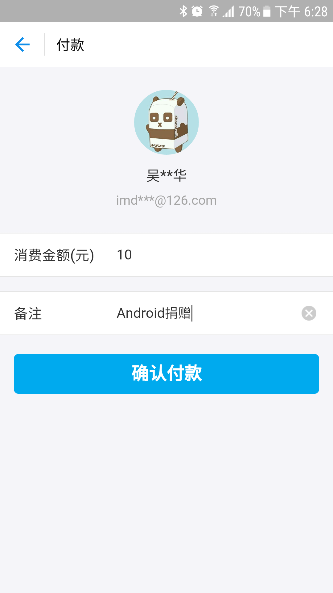

# Android 捐赠

> 目前支持 **支付宝**和 **微信**。

## 快速集成

**Step 1: **在你的 项目级别(不是 **Module**级别) `build.gradle` 里添加：
```
	allprojects {
		repositories {
			...
			maven { url 'https://jitpack.io' }
		}
	}
```
**Step 2: **在你的 `Module`级别 `build.gradle`里添加：

```
	dependencies {
	        compile 'com.github.didikee:AndroidDonate:0.1.0'
	}

```
## 快速使用

### 通过支付宝捐赠

```
    /**
     * 支付宝支付
     * @param payCode 收款码后面的字符串；例如：收款二维码里面的字符串为 https://qr.alipay.com/stx00187oxldjvyo3ofaw60 ，则
     *                payCode = stx00187oxldjvyo3ofaw60 
     *                注：不区分大小写
     */
    private void donateAlipay(String payCode) {
        boolean hasInstalledAlipayClient = AlipayDonate.hasInstalledAlipayClient(this);
        if (hasInstalledAlipayClient) {
            AlipayDonate.startAlipayClient(this, payCode);
        }
    }
```

### 通过微信捐赠

```
    /**
     * 需要提前准备好 微信收款码 照片，可通过微信客户端生成
     */
    private void donateWeixin() {
        InputStream weixinQrIs = getResources().openRawResource(R.raw.didikee_weixin);
        String qrPath = Environment.getExternalStorageDirectory().getAbsolutePath() + File.separator + "AndroidDonateSample" + File.separator +
                "didikee_weixin.png";
        WeiXinDonate.saveDonateQrImage2SDCard(qrPath, BitmapFactory.decodeStream(weixinQrIs));
        WeiXinDonate.donateViaWeiXin(this, qrPath);
    }
```


## 实现和操作细节

### 关于支付宝捐赠

关于支付宝捐赠，你需要准备好的是你的收款码，也就是方法中的`payCode`。
支付宝比微信好用、灵活、体验好，具体体现在 支付宝可以自定义金额收款，也可以生成商家收款码（商家收款未测试）。

从支付宝首页顶部的**收款**进入：（如图）


你可以自主选择设置金额和备注，然后保存二维码图片。

下一步就是提取二维码里面的`payCode`，我使用的是草料二维码识别：
连接如下：

**[草料二维码在线识别http://cli.im/deqr ](http://cli.im/deqr)**

得到`payCode`就可以实际使用了。

#### 附加 -- 商家收款

商家收款的前提是你开通了商家收款的功能（我忘记我什么时候开通了，反正就是开通了），你可以登录网页支付宝，然后依次点击：**商家服务 --> 查看商户收款码 --> 保存收款二维码**。

最后还是需要执行上面一样的步骤，从收款码中提取出`payCode`。

商家的收款界面和普通的转账付款界面略有不同，它是一个 Web 页面：（如下图）



### 关于微信捐赠

微信的体验不够好，目前只能说勉强能用。
原理是利用微信的二维码扫描支付，在启动的时候将自己的二维码放入相册中，并通知系统更新相册，这样用户就可以选择第一张图片，然后识别图片中的二维码最后完成支付操作。

虽然开发者的操作变少了，但是用户的操作变多了。对用户来说体验就变差了。

#### 附加 -- 二维码图片大小

保存的二维码图片比较大（我保存的**119KB**）需要压缩裁剪才能放入app中，获取从服务器获取。


## 最后

如果本文对你有帮助，可以打赏支持。**演示项目里就可以直接打赏就可以了 O(∩_∩)O~~**

